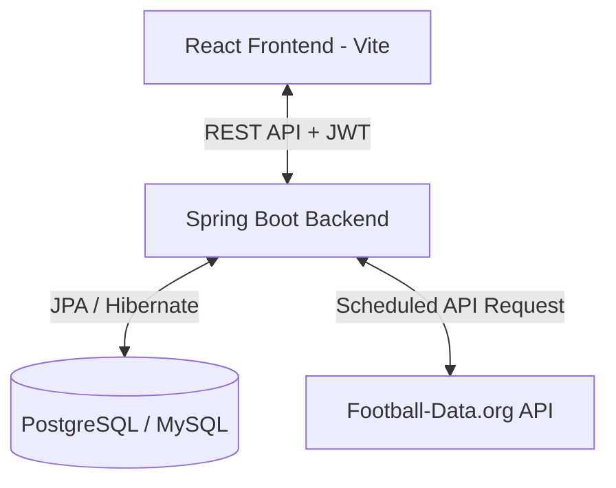

# Hướng Dẫn Thiết Kế & Xây Dựng Hệ Thống Cá Cược Tỉ Số World Cup 2026

Tài liệu này cung cấp hướng dẫn chi tiết từ thiết kế cơ sở dữ liệu, logic nghiệp vụ phân chia tiền thưởng, tích hợp API lịch thi đấu/kết quả bóng đá, cho đến cấu trúc mã nguồn Backend (Spring Boot) và Frontend (React Vite) để xây dựng ứng dụng cá cược tỉ số World Cup 2026.

---

## 1. Kiến Trúc Hệ Thống (System Architecture)

Hệ thống được thiết kế theo mô hình Client-Server chia làm 3 lớp chính:
- **Frontend**: React (Vite + TypeScript) - Giao diện người dùng tối ưu hóa cho di động và máy tính, hiển thị danh sách trận đấu, bảng xếp hạng và quản lý đặt cược. Sử dụng CSS Modern với thiết kế Dark Mode thể thao, Glassmorphism và micro-animations.
- **Backend**: Spring Boot (Java 17/21) - Cung cấp RESTful API, quản lý xác thực (JWT), xử lý giao dịch ví tiền, tính toán chia thưởng cá cược, và chạy tác vụ ngầm (Cron Job Scheduler) để cập nhật tỉ số tự động.
- **Database**: PostgreSQL hoặc MySQL - Lưu trữ thông tin người dùng, ví tiền, lịch thi đấu, vé cược và quỹ chung.



---

## 2. Thiết Kế Cơ Sở Dữ Liệu (Database Schema)

Dưới đây là sơ đồ thực thể và các trường dữ liệu cần thiết:

### 2.1. Bảng `users` (Quản lý người dùng)
Lưu trữ thông tin tài khoản và phân quyền.
- `id` (UUID, PK): Khóa chính sử dụng **UUID v7** (time-ordered UUID).
- `username` (VARCHAR, Unique): Tên đăng nhập.
- `password` (VARCHAR): Mật khẩu đã mã hóa (BCrypt).
- `email` (VARCHAR, Unique): Địa chỉ email.
- `role` (VARCHAR): Vai trò (`USER`, `ADMIN`).
- `created_at` (TIMESTAMP): Thời gian tạo tài khoản.

### 2.2. Bảng `wallets` (Quản lý ví tiền)
Mỗi user có duy nhất một ví tiền.
- `id` (UUID, PK): Khóa chính sử dụng **UUID v7**.
- `user_id` (UUID, FK -> `users.id`, Unique): Liên kết tới người dùng.
- `balance` (DECIMAL(15, 2)): Số dư tài khoản hiện tại (mặc định = 0).
- `updated_at` (TIMESTAMP): Thời gian cập nhật số dư cuối cùng.

### 2.3. Bảng `transactions` (Lịch sử giao dịch ví)
Theo dõi mọi biến động số dư ví (Nạp, rút, đặt cược, nhận thưởng).
- `id` (UUID, PK): Khóa chính sử dụng **UUID v7**.
- `wallet_id` (UUID, FK -> `wallets.id`): Liên kết tới ví.
- `amount` (DECIMAL(15, 2)): Số tiền giao dịch (cộng hoặc trừ).
- `type` (VARCHAR): Loại giao dịch (`DEPOSIT`, `WITHDRAW`, `BET_PLACED`, `BET_REFUND`, `WIN_PAYOUT`).
- `description` (VARCHAR): Mô tả chi tiết (ví dụ: "Đặt cược trận ARG - FRA", "Nhận thưởng trận BRA - GER").
- `created_at` (TIMESTAMP): Thời gian giao dịch.

### 2.4. Bảng `matches` (Lịch thi đấu & kết quả)
Lưu trữ thông tin các trận đấu World Cup đồng bộ từ API công cộng.
- `id` (UUID, PK): Khóa chính sử dụng **UUID v7**.
- `api_match_id` (BIGINT, Unique): ID trận đấu lấy từ API Football-Data (dùng để đồng bộ).
- `home_team` (VARCHAR): Tên đội nhà (e.g., "Vietnam").
- `away_team` (VARCHAR): Tên đội khách (e.g., "Argentina").
- `match_time` (TIMESTAMP): Thời gian diễn ra trận đấu.
- `status` (VARCHAR): Trạng thái trận đấu (`SCHEDULED` - Chưa đá, `IN_PLAY` - Đang đá, `FINISHED` - Đã kết thúc).
- `home_score` (INT, Nullable): Tỉ số đội nhà sau khi kết thúc.
- `away_score` (INT, Nullable): Tỉ số đội khách sau khi kết thúc.
- `pool_amount` (DECIMAL(15, 2)): Tổng số tiền cược của trận đấu này (mặc định = 0).
- `settled` (BOOLEAN): Đã phân phối tiền thưởng xong chưa (mặc định = false).

### 2.5. Bảng `bets` (Quản lý vé cược)
Lưu thông tin đặt cược tỉ số của người chơi.
- `id` (UUID, PK): Khóa chính sử dụng **UUID v7**.
- `user_id` (UUID, FK -> `users.id`): Người đặt cược.
- `match_id` (UUID, FK -> `matches.id`): Trận đấu đặt cược.
- `predicted_home_score` (INT): Tỉ số đội nhà dự đoán.
- `predicted_away_score` (INT): Tỉ số đội khách dự đoán.
- `bet_amount` (DECIMAL(15, 2)): Số tiền cược cho tỉ số này (mặc định và cố định là **10,000 VND**, không thể thay đổi).
- `settled` (BOOLEAN): Vé cược đã thanh toán chưa (mặc định = false).
- `payout_amount` (DECIMAL(15, 2)): Số tiền thưởng nhận được (nếu trúng).
- `created_at` (TIMESTAMP): Thời gian đặt cược.

### 2.6. Bảng `system_fund` (Quỹ chung & Phí hệ thống)
Quản lý Quỹ chung tích lũy và Phí nền tảng (10%).
- `id` (UUID, PK): Khóa chính sử dụng **UUID v7** (thường chỉ có 1 dòng duy nhất lưu trữ cấu hình hệ thống).
- `jackpot_amount` (DECIMAL(15, 2)): Tổng số tiền của Quỹ chung hiện tại (tích lũy từ các trận không có người trúng).
- `platform_fee_collected` (DECIMAL(15, 2)): Tổng phí hệ thống 10% đã trích ra.
- `updated_at` (TIMESTAMP): Thời gian cập nhật gần nhất.

---

## 3. Logic Nghiệp Vụ Chính (Core Business Logic)

### 3.1. Quy định đặt cược (Placing Bet)
1. **Thời gian hợp lệ**: Người dùng chỉ được đặt cược khi trận đấu ở trạng thái `SCHEDULED` (hoặc trước giờ lăn bóng ít nhất 5-15 phút tùy cấu hình).
2. **Quy định số tiền cược**:
   - Số tiền cược cho mỗi vé cược tỉ số là **mặc định và cố định là 10,000 VND** (không được thay đổi số tiền này).
   - Một người chơi được quyền đặt cược **nhiều tỉ số khác nhau** trong cùng một trận đấu (ví dụ: cược 2-1 giá 10k, cược 1-0 giá 10k, cược 2-2 giá 10k).
3. **Quy trình trừ tiền**:
   - Khi đặt cược, kiểm tra số dư ví: `balance >= 10,000`.
   - Trừ tiền ví của người dùng: `balance = balance - 10,000`.
   - Tạo bản ghi `transactions` với type = `BET_PLACED`.
   - Cộng dồn tiền vào tổng tiền cược của trận đấu: `matches.pool_amount = matches.pool_amount + 10,000`.

### 3.2. Công thức chia tiền thưởng (Payout Algorithm)
Khi trận đấu kết thúc (`status = FINISHED`), hệ thống tự động quét và phân chia quỹ tiền thưởng theo các bước sau:

1. **Xác định các thông số**:
   - Tổng tiền cược của trận đấu: $P$ (`matches.pool_amount`).
   - Phí nền tảng trích ra 10%: $F = P \times 10\%$.
   - Quỹ tiền thưởng thực tế của trận đấu: $R = P \times 90\%$.
   - Tỉ số thực tế trận đấu: (HomeScore - AwayScore).

2. **Tìm các vé cược thắng**:
   - Lọc tất cả các vé cược của trận đấu này có: `predicted_home_score == actual_home_score` và `predicted_away_score == actual_away_score`.
   - Gọi $W$ là danh sách các vé cược thắng.
   - Số lượng vé cược thắng: $count(W)$.

3. **Phân phối tiền thưởng**:

   #### Trường hợp A: CÓ ít nhất một người trúng tỉ số ($count(W) > 0$)
   Vì mọi vé cược đều có giá trị cố định là 10,000 VND, quỹ tiền thưởng thực tế $R$ sẽ được chia đều cho tất cả các vé cược thắng.
   Với mỗi vé cược thắng $b$, số tiền nhận được ($Payout_b$) là:
   $$Payout_b = \frac{R}{count(W)}$$
   
   > [!TIP]
   > **Mở rộng hấp dẫn (Tùy chọn Jackpot)**: Nếu muốn game kịch tính hơn, khi có người thắng, họ sẽ được chia thêm toàn bộ hoặc một tỷ lệ (ví dụ: 50%) từ **Quỹ chung** tích lũy hiện tại chia đều cho các vé cược thắng:
   > $$Payout_b = \frac{R + \text{Quỹ\_chung}}{count(W)}$$
   > Sau đó reset Quỹ chung về 0. Nếu không áp dụng Jackpot này, Quỹ chung sẽ hoạt động độc lập.

   - **Cập nhật ví người thắng**: Cộng $Payout_b$ vào ví của người chơi sở hữu vé cược thắng.
   - **Tạo giao dịch**: Tạo bản ghi `transactions` loại `WIN_PAYOUT` kèm mô tả cụ thể.
   - **Cập nhật phí**: Cộng $F$ vào tài khoản phí hệ thống `system_fund.platform_fee_collected`.

   #### Trường hợp B: KHÔNG CÓ AI trúng tỉ số ($T_W = 0$)
   - Toàn bộ quỹ thưởng $R$ (90% tổng tiền cược trận đó) sẽ được chuyển vào Quỹ chung tích lũy.
   - Cập nhật Quỹ chung: `system_fund.jackpot_amount = system_fund.jackpot_amount + R`.
   - Cộng phí hệ thống 10%: `system_fund.platform_fee_collected = system_fund.platform_fee_collected + F`.

4. **Đánh dấu hoàn thành**:
   - Cập nhật các vé cược liên quan thành `settled = true`.
   - Cập nhật trận đấu thành `settled = true`.

---

## 4. Tích Hợp API Lịch Thi Đấu & Kết Quả (Football API Integration)

Để lấy lịch thi đấu World Cup 2026 và tỉ số tự động, chúng ta sẽ tích hợp API của **Football-Data.org** (rất phổ biến và có gói miễn phí tốt).

### 4.1. Đăng ký & Cấu hình API
1. Truy cập [football-data.org](https://www.football-data.org/) đăng ký một tài khoản miễn phí để nhận API Token.
2. Cấu hình Token này trong file `application.yml` của Spring Boot:
   ```yaml
   football-api:
     token: "YOUR_API_TOKEN_HERE"
     base-url: "https://api.football-data.org/v4"
   ```

### 4.2. API Endpoints Quan Trọng
- **Lấy toàn bộ lịch thi đấu World Cup 2026 (Competition Code: WC)**:
  `GET https://api.football-data.org/v4/competitions/WC/matches`
  - *Lưu ý*: Đối với World Cup 2026, có thể cần lọc theo mùa giải `?season=2026`.
- **Headers yêu cầu**:
  - `X-Auth-Token: <YOUR_API_TOKEN_HERE>`

### 4.3. Cấu trúc JSON trả về (Ví dụ rút gọn)
```json
{
  "competition": { "id": 2000, "name": "FIFA World Cup", "code": "WC" },
  "matches": [
    {
      "id": 490001,
      "utcDate": "2026-06-11T20:00:00Z",
      "status": "TIMED",
      "homeTeam": { "id": 1, "name": "United States", "tla": "USA" },
      "awayTeam": { "id": 2, "name": "Mexico", "tla": "MEX" },
      "score": {
        "winner": null,
        "duration": "REGULAR",
        "fullTime": { "home": null, "away": null }
      }
    }
  ]
}
```

---

## 5. Hướng Dẫn Chi Tiết Xây Dựng Backend (Spring Boot)

### 5.1. Khởi tạo dự án
Tạo dự án Spring Boot mới (sử dụng Spring Initializr) với các dependency:
- Spring Web
- Spring Data JPA
- Spring Security (cho JWT Auth)
- H2 Database (để test nhanh) hoặc PostgreSQL/MySQL driver.
- Lombok

### 5.2. Cấu trúc thư mục Backend đề xuất
```
backend/
├── src/main/java/com/worldcup/bet/
│   ├── config/             # Cấu hình Spring Security, JWT, CORS, WebClient
│   ├── controller/         # Các REST Controller (Auth, Match, Bet, Wallet)
│   ├── entity/             # Các lớp JPA Entity (User, Match, Bet, Wallet, Transaction, SystemFund)
│   ├── repository/         # Các interface JPA Repository
│   ├── service/            # Lớp xử lý nghiệp vụ chính (WalletService, BetService, MatchSyncService)
│   ├── scheduler/          # Cron Job tự động đồng bộ tỉ số & trả thưởng
│   ├── dto/                # Data Transfer Objects (Request/Response API)
│   └── exception/          # Xử lý lỗi toàn cục (Global Exception Handler)
```

### 5.3. Xây dựng Scheduler đồng bộ và trả thưởng (Cron Job)
Tạo class `MatchScheduler` chạy định kỳ 10 phút một lần để cập nhật các trận đấu đang diễn ra và giải ngân tiền thưởng ngay khi trận đấu kết thúc.

```java
@Component
@RequiredArgsConstructor
public class MatchScheduler {

    private final MatchSyncService matchSyncService;
    private final BetService betService;

    // Chạy mỗi 10 phút
    @Scheduled(cron = "0 */10 * * * *")
    public void syncMatchesAndSettle() {
        // Step 1: Gọi Football API để cập nhật trạng thái & tỉ số các trận đấu mới nhất
        List<Match> finishedMatches = matchSyncService.syncWorldCupMatches();
        
        // Step 2: Lọc các trận đấu đã FINISHED nhưng chưa SETTLED để trả thưởng
        for (Match match : finishedMatches) {
            if (!match.isSettled()) {
                betService.settleMatchBets(match.getId());
            }
        }
    }
}
```

### 5.4. Hàm xử lý chia thưởng mẫu (Java)
Dưới đây là mã nguồn logic cốt lõi xử lý trả thưởng trong `BetServiceImpl.java` (sử dụng UUID v7 cho các thực thể và chia đều tiền cược):

```java
import com.github.f4b6a3.uuidcreator.UuidCreator;
import org.springframework.stereotype.Service;
import org.springframework.transaction.annotation.Transactional;
import lombok.RequiredArgsConstructor;
import java.math.BigDecimal;
import java.math.RoundingMode;
import java.time.LocalDateTime;
import java.util.List;
import java.util.UUID;

@Service
@RequiredArgsConstructor
@Transactional
public class BetServiceImpl implements BetService {

    private final MatchRepository matchRepository;
    private final BetRepository betRepository;
    private final WalletRepository walletRepository;
    private final TransactionRepository transactionRepository;
    private final SystemFundRepository systemFundRepository;

    @Override
    public void settleMatchBets(UUID matchId) {
        Match match = matchRepository.findById(matchId)
                .orElseThrow(() -> new EntityNotFoundException("Không tìm thấy trận đấu"));

        if (match.isSettled() || !match.getStatus().equals("FINISHED")) {
            return;
        }

        BigDecimal totalPool = match.getPoolAmount();
        if (totalPool.compareTo(BigDecimal.ZERO) <= 0) {
            match.setSettled(true);
            matchRepository.save(match);
            return; // Không có ai cược trận này
        }

        // 1. Trích phí hệ thống 10%
        BigDecimal platformFee = totalPool.multiply(new BigDecimal("0.10"));
        BigDecimal netPool = totalPool.subtract(platformFee);

        // Cập nhật doanh thu hệ thống
        SystemFund fund = systemFundRepository.findOrCreateSingleFund();
        fund.setPlatformFeeCollected(fund.getPlatformFeeCollected().add(platformFee));

        // 2. Tìm danh sách vé cược trúng tỉ số
        int actualHome = match.getHomeScore();
        int actualAway = match.getAwayScore();
        
        List<Bet> winningBets = betRepository.findWinningBets(matchId, actualHome, actualAway);

        if (winningBets.isEmpty()) {
            // Trường hợp không có ai thắng: Đẩy 90% số tiền cược vào Quỹ chung (Jackpot)
            fund.setJackpotAmount(fund.getJackpotAmount().add(netPool));
            systemFundRepository.save(fund);
        } else {
            // Trường hợp có người thắng: Chia đều tiền thưởng Net Pool cho các vé thắng
            int winCount = winningBets.size();
            BigDecimal payout = netPool.divide(new BigDecimal(winCount), 2, RoundingMode.HALF_DOWN);

            for (Bet bet : winningBets) {
                // Cập nhật trạng thái vé cược
                bet.setSettled(true);
                bet.setPayoutAmount(payout);
                betRepository.save(bet);

                // Cộng tiền vào ví của User
                Wallet wallet = walletRepository.findByUserId(bet.getUserId())
                        .orElseThrow(() -> new RuntimeException("Không tìm thấy ví người dùng"));
                wallet.setBalance(wallet.getBalance().add(payout));
                walletRepository.save(wallet);

                // Ghi nhận lịch sử giao dịch ví (Tạo ID giao dịch bằng UUID v7)
                Transaction tx = new Transaction();
                tx.setId(UuidCreator.getTimeOrderedEpoch()); // UUID v7
                tx.setWalletId(wallet.getId());
                tx.setAmount(payout);
                tx.setType("WIN_PAYOUT");
                tx.setDescription(String.format("Thắng cược tỉ số %d-%d trận %s vs %s", 
                        actualHome, actualAway, match.getHomeTeam(), match.getAwayTeam()));
                tx.setCreatedAt(LocalDateTime.now());
                transactionRepository.save(tx);
            }
        }

        // 3. Cập nhật trạng thái trận đấu đã phân phối tiền thưởng
        match.setSettled(true);
        matchRepository.save(match);
        systemFundRepository.save(fund);
    }
}
```

> [!NOTE]
> **Cách tự động sinh UUID v7 trong Spring Data JPA**:
> Để các Entities tự động sinh ID dạng UUID v7 khi lưu vào database, bạn có thể định nghĩa lớp cha `@MappedSuperclass` hoặc viết sự kiện `@PrePersist` như sau:
> 
> ```java
> @MappedSuperclass
> @Getter
> @Setter
> public abstract class BaseEntity {
>     @Id
>     private UUID id;
> 
>     @PrePersist
>     protected void onCreate() {
>         if (this.id == null) {
>             this.id = com.github.f4b6a3.uuidcreator.UuidCreator.getTimeOrderedEpoch();
>         }
>     }
> }
> ```
> Các class `User`, `Wallet`, `Match`, `Bet`, `Transaction` chỉ cần `extends BaseEntity` là sẽ tự động có cột `id` dạng UUID v7 được sinh ra theo thứ tự thời gian.

---

## 6. Hướng Dẫn Chi Tiết Xây Dựng Frontend (React Vite)

Giao diện sẽ được xây dựng tối ưu trải nghiệm người dùng với cấu trúc đơn giản, hiện đại và tập trung vào dữ liệu trực quan.

### 6.1. Khởi tạo Frontend với React Vite
Chạy lệnh trong thư mục `frontend`:
```bash
npx -y create-vite@latest ./ --template react-ts
npm install axios react-router-dom lucide-react @tanstack/react-query
```

### 6.2. Cấu trúc thư mục Frontend đề xuất
```
frontend/
├── src/
│   ├── assets/             # Hình ảnh, logo giải đấu
│   ├── components/         # Component dùng chung (Navbar, Card, Modal)
│   ├── context/            # AuthContext, WalletContext quản lý state toàn cục
│   ├── pages/              # Trang Dashboard, Lịch thi đấu, Ví tiền, Xếp hạng
│   ├── services/           # Định nghĩa các hàm call API (api.ts, auth.ts, match.ts)
│   ├── index.css           # Cấu hình UI variables, CSS Base, Animations
│   ├── App.tsx             # Định tuyến & Bố cục ứng dụng
│   └── main.tsx
```

### 6.3. Thiết kế CSS Premium & Responsive (index.css)
Sử dụng các biến HSL hiện đại, tạo phong cách Dark Mode thể thao kết hợp Glassmorphism.

```css
@import url('https://fonts.googleapis.com/css2?family=Outfit:wght@300;400;500;600;700;800&display=swap');

:root {
  --font-sans: 'Outfit', sans-serif;
  
  /* Palette màu bóng đá thể thao cao cấp */
  --background: 224 30% 8%;
  --card: 224 25% 12%;
  --primary: 142 70% 45%;      /* Màu cỏ xanh bóng đá */
  --primary-glow: 142 70% 45% / 0.15;
  --accent: 47 95% 55%;        /* Màu vàng cúp vàng FIFA */
  --text-main: 0 0% 98%;
  --text-muted: 220 15% 65%;
  --border: 224 20% 20%;
  
  --glass-bg: rgba(15, 23, 42, 0.45);
  --glass-border: rgba(255, 255, 255, 0.08);
}

body {
  font-family: var(--font-sans);
  background-color: hsl(var(--background));
  color: hsl(var(--text-main));
  margin: 0;
  overflow-x: hidden;
}

/* Hiệu ứng Glassmorphism cho các khung thẻ trận đấu */
.glass-panel {
  background: var(--glass-bg);
  backdrop-filter: blur(16px);
  -webkit-backdrop-filter: blur(16px);
  border: 1px solid var(--glass-border);
  border-radius: 16px;
  box-shadow: 0 8px 32px 0 rgba(0, 0, 0, 0.37);
  transition: all 0.3s cubic-bezier(0.4, 0, 0.2, 1);
}

.glass-panel:hover {
  border-color: hsl(var(--primary) / 0.3);
  box-shadow: 0 8px 32px 0 hsl(var(--primary) / 0.1);
  transform: translateY(-2px);
}

/* Micro-animations cho nút bấm đặt cược */
.btn-primary {
  background: linear-gradient(135deg, hsl(var(--primary)), #059669);
  color: #fff;
  border: none;
  font-weight: 600;
  padding: 10px 20px;
  border-radius: 8px;
  cursor: pointer;
  transition: all 0.2s ease;
  box-shadow: 0 4px 14px 0 hsl(var(--primary) / 0.4);
}

.btn-primary:hover {
  transform: scale(1.03);
  box-shadow: 0 6px 20px 0 hsl(var(--primary) / 0.6);
}

.btn-primary:active {
  transform: scale(0.98);
}
```

### 6.4. Các màn hình chính trong giao diện
1. **Trang Dashboard & Danh sách Trận đấu**:
   - Hiển thị tổng quan Quỹ chung (Jackpot) hiện tại lớn cỡ nào (tạo sự hấp dẫn).
   - Chia bộ lọc làm 3 tab: "Sắp thi đấu", "Đang diễn ra", "Đã kết thúc".
   - Mỗi thẻ trận đấu gồm: Logo & tên 2 đội, thời gian, trạng thái, tổng tiền cược hiện tại của trận đấu (`pool_amount`).
   - Nếu trận đấu chưa diễn ra, có nút "Đặt cược tỉ số".
2. **Modal đặt cược tỉ số**:
   - Form nhập Tỉ số dự đoán (Home Score - Away Score).
   - Ô hiển thị số tiền cược mặc định là **10,000 VND** (được khóa cứng - read-only, không cho sửa đổi).
   - Kiểm tra số dư ví khi đặt: Nếu `balance < 10,000` thì vô hiệu hóa nút cược và báo số dư không đủ.
3. **Trang Quản lý Ví tiền (Wallet)**:
   - Hiển thị số dư hiện tại.
   - Form Nạp tiền giả lập (để người chơi thử nghiệm, nhập số tiền cần nạp và bấm "Nạp ngay").
   - Bảng lịch sử giao dịch chi tiết các giao dịch trừ tiền đặt cược, cộng tiền khi trúng thưởng.
4. **Trang Bảng Xếp Hạng (Leaderboard)**:
   - Cho phép người chơi theo dõi bảng xếp hạng Top 10 dựa trên 3 tiêu chí:
     1. **Tỉ lệ thắng cao nhất** (Win Rate): Số trận thắng / tổng số trận đã cược đã quyết toán.
     2. **Số tiền ăn nhiều nhất** (Total Win Amount): Tổng số tiền nhận được từ các vé cược thắng.
     3. **Tỉ lệ thua cao nhất** (Loss Rate): Số trận thua / tổng số trận đã cược đã quyết toán (Thần đèn đen đủi).
   - Thiết kế dạng các tab chuyển đổi mượt mà, cập nhật trực quan và nhanh chóng.

---

## 7. Các Bước Triển Khai và Kiểm Thử (Verification & Deployment)

### Step 1: Khởi chạy Cấu hình local
1. Chạy Backend bằng IDE (IntelliJ/Eclipse) hoặc chạy dòng lệnh `mvn spring-boot:run` từ thư mục `backend`.
2. Khởi chạy Frontend bằng lệnh `npm run dev` từ thư mục `frontend`.

### Step 2: Kịch bản kiểm thử nghiệp vụ chia thưởng
Do World Cup 2026 chưa diễn ra nên để kiểm thử, nhà phát triển cần thực hiện mock dữ liệu như sau:
1. Tạo 3 tài khoản người dùng: `userA`, `userB`, `userC` (tất cả có ID dạng UUID v7).
2. Sử dụng API nạp tiền giả lập để cộng cho mỗi người `100,000 VND`.
3. Tạo một trận đấu mẫu trong DB: **Vietnam vs Argentina**, status = `SCHEDULED` (ID trận đấu dạng UUID v7, có cột `api_match_id` để map).
4. Người chơi đặt cược tỉ số (mọi vé cược bắt buộc là 10,000 VND):
   - `userA` cược tỉ số **2 - 1** số tiền **10,000 VND**.
   - `userB` cược tỉ số **2 - 1** số tiền **10,000 VND**.
   - `userC` cược tỉ số **3 - 1** số tiền **10,000 VND**.
   - Tổng tiền cược ($P$) = `30,000 VND`.
5. Thực hiện đóng trận đấu giả lập bằng cách cập nhật DB (hoặc gọi API Mock):
   - Thay đổi trạng thái trận đấu thành `FINISHED`.
   - Cập nhật tỉ số thực tế là **2 - 1**.
6. Kích hoạt logic chia thưởng (`settleMatchBets` truyền UUID của trận đấu):
   - Phí hệ thống 10%: $F = 3,000$ VND.
   - Quỹ chia thưởng 90%: $R = 27,000$ VND.
   - Người trúng là `userA` và `userB` (do đoán đúng tỉ số 2 - 1).
   - Số lượng vé cược trúng: 2 vé.
   - Số tiền mỗi người nhận được: $Payout = 27,000 / 2 = 13,500$ VND.
7. Xác minh số dư ví người dùng sau khi thanh toán và kiểm tra bảng giao dịch.
8. Thử nghiệm trường hợp không có ai đoán đúng tỉ số thực tế để xem tiền có tự động cộng vào `system_fund.jackpot_amount` (Quỹ chung) hay không.

---

## 8. Hướng Dẫn Tính Năng Quyền OWNER & Trang Admin (Admin Panel)

Để tạo điều kiện thuận lợi cho việc kiểm thử và vận hành hệ thống, một tài khoản Quản trị tối cao (`OWNER`) đã được tích hợp sẵn cùng trang quản trị tập trung (Admin Control Panel).

### 8.1. Tài khoản OWNER mặc định
Khi ứng dụng Backend Spring Boot khởi chạy lần đầu tiên, hệ thống sẽ tự động seed một tài khoản có quyền cao nhất:
* **Tên đăng nhập (Username)**: `admin`
* **Mật khẩu (Password)**: `haminhnhat123`
* **Vai trò (Role)**: `OWNER`
* **Email**: `admin@worldcupbet.com`
* **Ví tiền**: Tự động khởi tạo kèm theo tài khoản.

### 8.2. Cấu hình bảo mật Backend (API Admin)
Tất cả các API quản trị được nhóm dưới tiền tố `/api/admin/**` và được bảo vệ nghiêm ngặt:
* Đường dẫn cấu hình: [WebSecurityConfig.java](file:///e:/10.Project/07.bet/backend/src/main/java/com/worldcup/bet/config/WebSecurityConfig.java)
* Quy tắc: `.requestMatchers("/api/admin/**").hasRole("OWNER")`

Các API quản trị cụ thể trong [AdminController.java](file:///e:/10.Project/07.bet/backend/src/main/java/com/worldcup/bet/controller/AdminController.java):
1. **Lấy danh sách người dùng**: `GET /api/admin/users` (trả về danh sách thông tin cơ bản của tất cả người dùng, không bao gồm mã băm mật khẩu để đảm bảo an toàn).
2. **Reset mật khẩu**: `POST /api/admin/users/reset-password`
   - Body: `{"userId": "UUID", "newPassword": "mật_khẩu_mới"}`
3. **Cập nhật tỉ số & Quyết toán thưởng**: `PUT /api/admin/matches/{matchId}/result`
   - Body: `{"status": "FINISHED", "homeScore": X, "awayScore": Y}`
   - *Hành vi*: Cập nhật tỉ số trận đấu sang `FINISHED` và tự động thực hiện tính toán, phân phối tiền thưởng ngay lập tức. (Chỉ cho phép thực hiện ở chế độ GIẢ LẬP).
4. **Tạo trận đấu mới**: `POST /api/admin/matches`
   - Body: `{"homeTeam": "Tên Đội Nhà", "awayTeam": "Tên Đội Khách", "matchTime": "yyyy-MM-ddTHH:mm:ss"}`
   - *Hành vi*: Tạo một trận đấu mới ở trạng thái `SCHEDULED` với mã `apiMatchId` được tạo ngẫu nhiên dựa trên thời gian thực tế để tránh trùng lặp.
5. **Chuyển đổi chế độ hệ thống**: `POST /api/admin/system/mode`
   - Body: `{"mode": "REAL" | "SIMULATION"}`
   - *Hành vi*: Chuyển đổi giữa chế độ THỰC TẾ và GIẢ LẬP. Thông tin này được lưu trữ trong bảng `system_fund.system_mode`.

### 8.3. Giao diện Admin Panel ở Frontend
Trang quản lý dành riêng cho admin được triển khai tại file [Admin.tsx](file:///e:/10.Project/07.bet/frontend/src/pages/Admin.tsx) (định tuyến tại `/admin`):
* **Cơ chế bảo vệ**: Tự động chuyển hướng về trang chủ nếu người dùng chưa đăng nhập hoặc không có vai trò `OWNER`.
* **Menu điều hướng**: Tự động hiển thị nút tab **"Quản trị (Admin)"** trên thanh [Navbar.tsx](file:///e:/10.Project/07.bet/frontend/src/components/Navbar.tsx) nếu tài khoản đăng nhập có vai trò `OWNER` hoặc `ADMIN`.
* **Các tính năng trên giao diện**:
  1. **Bộ cấu hình Chế độ hệ thống**: Nằm ngay đầu trang Admin. Cho phép Admin bấm nút để chuyển đổi qua lại giữa chế độ **THỰC TẾ** và **GIẢ LẬP**.
     - Ở chế độ **THỰC TẾ**: Khóa tính năng nhập tỉ số thủ công trên giao diện. Hệ thống tự động kích hoạt Scheduler chạy mỗi 30 phút để gọi Football-Data API cập nhật tỉ số các trận đấu World Cup.
     - Ở chế độ **GIẢ LẬP**: Mở khóa nút "Nhập tỉ số & Quyết toán" để Admin tự do nhập tỉ số trận đấu bất kỳ nhằm mục đích kiểm thử nhanh.
  2. **Nút "+ Tạo trận đấu"**: Nằm ở góc trên bên phải tiêu đề trang Admin. Khi click sẽ hiển thị Form Modal cho phép nhập thông tin Đội nhà, Đội khách và thời gian diễn ra để tạo mới một trận đấu.
  3. **Bộ lọc tìm kiếm trận đấu**: Bổ sung thanh tìm kiếm nhanh theo tên đội tuyển ở cả trang Dashboard và trang Admin giúp tìm kiếm trận đấu tức thì, tránh hiển thị quá nhiều dữ liệu gây quá tải.
  4. **Tab Quản lý tỉ số**: Hiển thị toàn bộ danh sách trận đấu cùng tổng số tiền cược hiện tại của từng trận. Với các trận chưa kết toán, Admin có thể bấm nút **"Nhập tỉ số & Kết toán"** để mở Modal nhập tỉ số và tiến hành thanh toán cược.
  5. **Tab Quản lý người dùng**: Hiển thị bảng danh sách các tài khoản người dùng (`username`, `email`, `role`, `createdAt`). Bên cạnh mỗi tài khoản có nút **"Reset Pass"** cho phép Admin đặt lại mật khẩu mới cho người dùng đó một cách dễ dàng.

